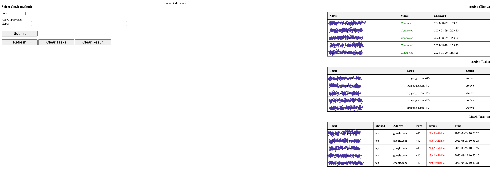

## Kubernetes Port-Check Application

### **Overview**

The Kubernetes Port-Check application is designed to quickly verify the accessibility of specific addresses and ports from all nodes within a Kubernetes cluster. It consists of a client-server model where:

-   **Client**: Runs as a DaemonSet on worker nodes.
-   **Server**: Deployed as a Deployment, provides a web interface for task submission, viewing results, and general management.

### **Features**

1.  **Deployment**: Specifically tailored for deployment in a Kubernetes environment.
2.  **Dual Components**: Comprises both a client (DaemonSet on worker nodes) and a server (Deployment with a web interface).
3.  **Versatile Checking**: Can conduct checks via TCP, UDP, or Ping.
4.  **Automatic Client Registration**: Every client automatically registers on the server and sends a health status. For each active client, the server formulates a task when a check is initiated. Subsequently, the client returns the outcome to the server.
5.  **Web Interface Alternatives**: Instead of the web interface, users can send POST requests for resource checks and retrieve results in JSON format.


### **Usage**

#### Using the Web Interface

Navigate to the provided server URL to submit check requests and view results.

#### Using cURL

1.  **Submit a check request**:
    
    `curl -k -X POST -d "checkMethod=tcp&address=what-you-need-chek.com&port=443" http://check-port.check.svc:8080/submit` 
    
    -   The `checkMethod` can be `tcp`, `udp`, or `ping`.
2.  **Retrieve the results**:
    
    `curl -k http://check-port.check.svc:8080/results_keeper` 
    

#### **Sample Result Format**

The result will be provided in JSON format as shown below:

```json

{
    "you-active-client1.your.domain.com": {
        "ClientName": "you-active-client1.your.domain.com",
        "CheckMethod": "tcp",
        "Address": "google.com",
        "Port": "443",
        "Result": "Available",
        "Time": "2023-07-18T08:41:12.979660049Z"
    },
    "you-active-client2.your.domain.com": {
        "ClientName": "you-active-client2.your.domain.com",
        "CheckMethod": "tcp",
        "Address": "google.com",
        "Port": "443",
        "Result": "Available",
        "Time": "2023-07-18T08:41:12.792420135Z"
    }
}
```

### **Contributions**

Feel free to contribute to the project by submitting a pull request or raising an issue. We appreciate your input!
